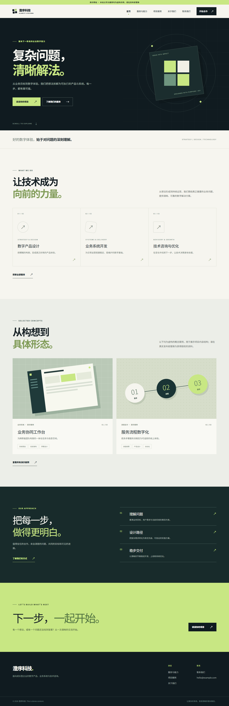

# AI Enterprise Website Starter · AI 企业官网 Starter

一个可修改、可静态构建、可用 Docker 部署的企业官网起点。技术栈为 Astro、TypeScript、Tailwind CSS、Nginx。运行网站不需要数据库、后端服务、付费 API 或 AI 密钥。

> **演示内容说明：** 网站中的“澄序科技”、服务描述和所有项目案例均为虚构示例，不代表真实客户、项目成果或商业资质。发布前请替换为你有权使用的资料。



## Features

- 五个主要页面：首页、服务与能力、项目案例、关于我们、联系我们，另有 404 页面。
- 公司信息、服务、案例、页面 SEO 文案集中在 `src/config/site.ts`。
- 响应式布局与无 JavaScript 的移动导航；联系按钮使用 `mailto:`，没有伪装成可发送的表单。
- 静态输出、canonical、Open Graph、favicon、robots.txt 和 sitemap.xml。
- 多阶段 Docker 构建，以 Nginx 提供静态文件；Compose 默认映射本机 8080 端口。

## Tech Stack

| 用途 | 技术 |
| --- | --- |
| 页面与静态构建 | Astro 7、TypeScript |
| 样式 | Tailwind CSS 4 与项目 CSS |
| 容器构建 | Node.js 22 |
| 容器运行 | Nginx Alpine |

## Quick Start

需要 Node.js 22.12+ 和 npm。克隆后执行：

```bash
git clone https://github.com/xichugeek/XichuGeekEnterpriseSite.git
cd XichuGeekEnterpriseSite
npm ci
npm run dev
```

浏览 `http://localhost:4321/`。正式构建：

```bash
# 将域名换成你自己的，影响 canonical、Open Graph 和 sitemap
PUBLIC_SITE_URL=https://www.your-company.example npm run build
npm run preview
```

PowerShell 中设置构建变量的方法：`$env:PUBLIC_SITE_URL='https://www.your-company.example'; npm run build`。

`https://example.com` 是默认占位域名。**部署前一定要设置实际公开域名并重新构建**，否则 SEO 链接仍指向示例域名。`PUBLIC_SITE_URL` 是公开构建参数，不要在其中放密码或令牌。

## 修改企业信息

编辑 [`src/config/site.ts`](src/config/site.ts)：

1. 修改 `site.companyName`、`englishName`、`tagline`、`description`、`about` 和首页 Hero 文案。
2. 修改 `email`、`phone`、`address`、`social`。邮箱链接会自动使用新地址；需要可拨电话时，可在联系页加上 `tel:` 链接。
3. 修改 `site.seo` 中每个页面的标题和描述。
4. 将 Logo 放入 `public/`，然后把 `site.logo` 设为例如 `/logo.svg`；留空则使用 CSS 品牌标记。同步替换 `public/favicon.svg`。社交分享图是 `public/og-cover.png`；可自行替换，或安装 Pillow 后运行 `python scripts/generate-og.py` 生成示例封面（需要常见中文字体）。
5. 调整品牌色时，修改 `src/styles/global.css` 中的 Tailwind `@theme` 色值及相关 CSS 色值。
6. 将页面中的演示说明和虚构公司故事替换为真实资料后，再移除演示标识。不要保留虚构客户评价或业绩。

## 修改服务和项目

同一文件中的 `services` 和 `projects` 数组就是内容来源。修改、添加或删除条目即可更新页面；首页默认展示前两个项目。案例卡片用 CSS 绘制概念图，不需要图片授权。若换成照片，建议提供 WebP/AVIF、正确的 `alt` 文本、宽高和延迟加载。

## Local Development

```bash
npm ci
npm run dev
npm run check
npm run build
npm run preview
```

本地路径包括 `/`、`/services/`、`/projects/`、`/about/`、`/contact/`。不存在的路径应显示 404。构建结果位于 `dist/`，这个目录不提交到 Git。

## Docker Deployment

```bash
# 可复制 .env.example 并填入公开域名；不要在 .env 中提交真实密钥
PUBLIC_SITE_URL=https://www.your-company.example docker compose up -d --build
# 浏览 http://localhost:8080/
docker compose down
```

PowerShell：`$env:PUBLIC_SITE_URL='https://www.your-company.example'; docker compose up -d --build`。用 `SITE_PORT=8081` 可修改主机端口。Compose 只负责 HTTP 容器；正式 HTTPS 与域名设置见 [部署指南](docs/DEPLOYMENT.md)。

## Production Deployment

请先修改真实公司资料，并用正式域名重新构建。普通 Ubuntu VPS 的域名、反向代理、HTTPS、更新与回滚流程详见 [docs/DEPLOYMENT.md](docs/DEPLOYMENT.md)。不要把管理面板、证书私钥或生产 `.env` 提交到公开仓库。

## Screenshots

| 页面 | 截图 |
| --- | --- |
| 首页桌面 | [查看](docs/screenshots/homepage-desktop.png) |
| 首页移动 | [查看](docs/screenshots/homepage-mobile.png) |
| 服务 | [查看](docs/screenshots/services.png) |
| 项目 | [查看](docs/screenshots/projects.png) |
| 关于 | [查看](docs/screenshots/about.png) |
| 联系 | [查看](docs/screenshots/contact.png) |

## Directory Structure

```text
src/
  components/       共用页眉、页脚、项目卡片
  config/site.ts     企业资料、服务、案例、SEO 文案
  layouts/           SEO 与页面布局
  pages/             各路由、robots、sitemap、404
  styles/            Tailwind 入口与样式
public/             favicon、社交分享封面
docs/               部署、AI 开发记录和截图
Dockerfile           Node 构建 + Nginx 运行
docker-compose.yml  本机或 VPS 容器启动
nginx.conf           静态文件、缓存和安全响应头
```

## License

[MIT](LICENSE)。
